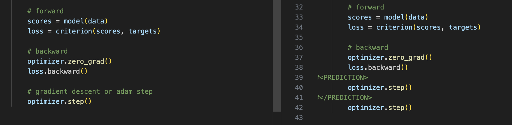

# AI Code Completion Evaluation
This repository contains a code completion model for predicting missing code segments between given prefixes and suffixes. The goal is to evaluate the model's ability to generate accurate code completions by comparing predicted code with ground truth using various evaluation metrics. 

The dataset were generated manually by using our code that were written in past in one of the repositories.

## Repository Structure
```

├── artifacts/               # Folder for storing any generated visualizations
├── data/
│   ├── code/                # Contains JSON file with prefixes, suffixes, and ground truth middle parts
│   ├── code_files/          # Code files used as test data for the model
│   ├── generated_code_files/ # Code files generated by the model
├── utils/
│   ├── eval.py              # Evaluation functions for model performance
│   ├── data_generation.py   # Script to generate JSON files with prefix, suffix, and middle part
│   ├── func.py              # Utility functions used across scripts
│   ├── model_run.py         # Script for loading and applying the model on data
├── main.py                  # Runs all scripts in the required order
├── visualization.ipynb      # Notebook for visualizing evaluation results
├── LICENSE                  # License file
├── .gitignore               # Gitignore file
```
## Evaluation Metrics
To assess the model's performance, we use the following evaluation metrics:

1. **Exact Match**
    - **Definition**: Measures if the predicted middle part exactly matches the ground truth middle part.
    - **Formula**:\[
        \text{Exact Match} = \frac{\text{Number of Exact Matches}}{\text{Total Number of Examples}}
        \]
 
2. **BLEU Score**
    - **Definition**: BLEU (Bilingual Evaluation Understudy) score measures the similarity between predicted and ground truth code, focusing on matching n-grams.
    - **Formula**:\[
        \text{BLEU} = \text{exp} \left( \min \left( 1 - \frac{|C|}{|R|}, 0 \right) + \sum_{n=1}^{N} w_n \cdot \log p_n \right)
        \]
    Where \( |C| \) is the length of the predicted output, \( |R| \) is the length of the reference, \( w_n \) are weights, and \( p_n \) is the precision of n-grams.

3. **CHRF Score**
    - **Definition**: CHRF (Character F-score) calculates the F-score based on character n-grams, focusing on capturing similarities at a finer granularity than BLEU.
    - **Formula**:\[
        \text{CHRF} = \frac{2 \cdot \text{Precision} \cdot \text{Recall}}{\text{Precision} + \text{Recall}}
        \]
​
 
4. **Functional Accuracy**
    - **Definition**: Functional accuracy tests if the generated code behaves as expected by running both the generated and ground truth code with the same inputs and comparing their outputs.
    - **Calculation**: Code is run in a controlled environment, and outputs are compared for correctness.

## Results
Below is a table for inputting the evaluation metrics' results:

| Metric               | Score                |
|----------------------|----------------------|
| Exact Match          |        0.086         |
| BLEU Score           |          0.115       |
| CHRF Score           |           0.305      |
| Functional Accuracy  |          0.857       |

generally we can see that the models Functional Accuracy is quite good which could be due to the fact that we will discuss later - prediction of middle part included suffix part as well in many cases, therefore because of the code repetition we could observe that the BLEU score is low but the functional accuracy is high.

## Example Predictions

Here are some example predictions made by the model, with the ground truth for comparison. On the left hand side is the ground truth and on the right hand side is predictions made by the model.




After examples we can observe that in most of the cases the model predicts the part of the suffix as well, therefore we may conclude that given model is better when we predict not only one line of the code between prefix and suffix, but we predict between 5-20 rows, in some examples we could observe the prediction length of at least 500 tokens while only 10 were needed to fullfill the task. Or more research onto the model behaviour is needed.

## Example Evaluation Run
- **Data Preparation**: Run data_generation.py to create the JSON file containing code snippets (prefix, suffix, and middle).
- **Model Prediction**: Execute model_run.py to load the model, apply it to each prefix and suffix, and generate predictions.
- **Evaluation**: Use eval.py to calculate evaluation metrics, comparing the generated middle code with the ground truth middle code.
- **Visualization**: Open visualization.ipynb to visualize the evaluation results.

## How to Run
1. Clone the repository.
2. Ensure all dependencies are installed.
3. Run main.py to generate predictions and evaluate them using the defined metrics.

## License
This project is licensed under the terms of the LICENSE file.